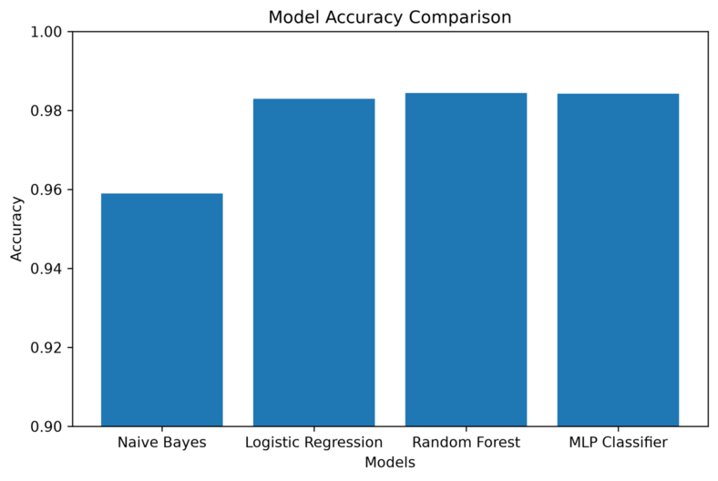
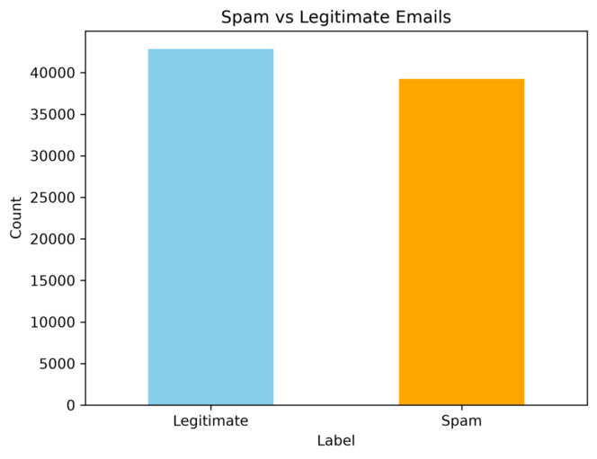
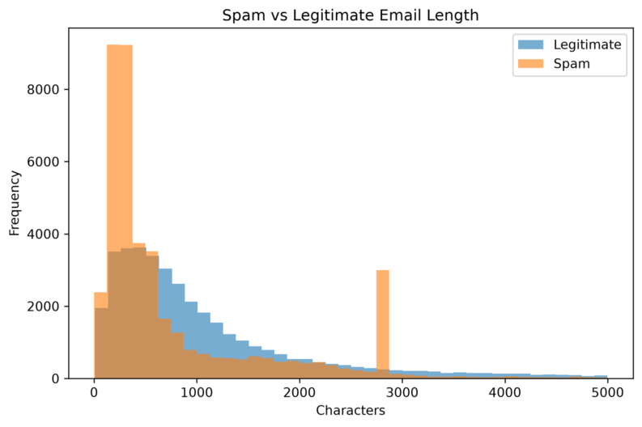
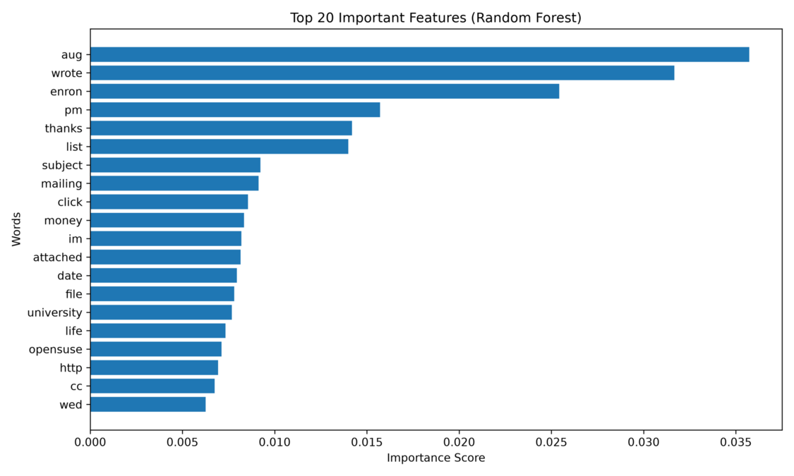
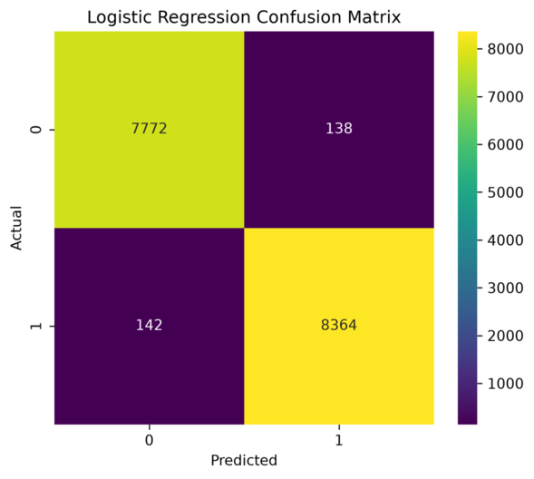

<div align="center">

# 📧 AI-Driven Phishing Email Detection Using NLP

**Detecting phishing and spam emails from raw text using Natural Language Processing and Machine Learning**


</div>

---

## TL;DR

This project builds a **spam / phishing email classifier** using **NLP (TF‑IDF)** and four machine learning algorithms — **Multinomial Naive Bayes, Logistic Regression, Random Forest, and an MLP Neural Network**. The models were trained on a combined dataset of **82,078 emails** (legitimate vs. spam). After text cleaning and TF‑IDF feature extraction (5,000 features), **Random Forest achieved the best accuracy at 98.44%**, closely followed by the MLP Classifier (98.43%) and Logistic Regression (98.29%).

<p align="center">
  
</p>
<p align="center"><i>Model accuracy comparison — Random Forest leads at 98.44%</i></p>

---

## 📑 Table of Contents

| | | |
|---|---|---|
| [🧭 1. Project Overview](#1-project-overview) | [🎯 2. Project Objectives](#2-project-objectives) | [🗃️ 3. Dataset Description](#3-dataset-description) |
| [🛠️ 4. Technologies Used](#4-technologies-used) | [🔄 5. Project Workflow](#5-project-workflow) | [🧹 6. Data Preprocessing](#6-data-preprocessing) |
| [🔍 7. Exploratory Data Analysis](#7-exploratory-data-analysis-eda) | [📊 8. Feature Extraction (TF-IDF)](#8-feature-extraction-tf-idf) | [✂️ 9. Train-Test Split](#9-train-test-split) |
| [🤖 10. Machine Learning Models](#10-machine-learning-models) | [📈 11. Model Evaluation](#11-model-evaluation) | [🏆 12. Model Comparison](#12-model-comparison) |
| [✅ 13. Results](#13-results) | [📁 14. Project Folder Structure](#14-project-folder-structure) | [🗂️ 15. Project Outputs](#15-project-outputs) |
| [⚙️ 16. Installation Guide](#16-installation-guide) | [🚀 17. Usage Guide](#17-usage-guide) | [🔭 18. Future Scope](#18-future-scope) |
| [⚠️ 19. Limitations](#19-limitations) | [🏁 20. Conclusion](#20-conclusion) | [📚 21. References](#21-references) |
| [👤 22. Author](#22-author) | | |

---

## 🧭 1. Project Overview

Email is one of the most widely used forms of digital communication, but not every email that lands in an inbox is trustworthy. **Phishing and spam emails** often contain fake offers, malicious links, or harmful content designed to steal personal information or waste users' time. Manually checking every email is impractical given the sheer volume received daily.

This project builds an automated system that classifies emails as **spam/phishing** or **legitimate (ham)** using **Natural Language Processing (NLP)** to convert raw email text into numerical features, and **Machine Learning** to learn patterns that separate the two classes. Four different algorithms were trained and benchmarked on the same dataset and train/test split to ensure a fair comparison.

## 🎯 2. Project Objectives

- Build a text-based system to automatically classify emails as **spam** or **legitimate**.
- Clean and preprocess raw email text using standard NLP techniques.
- Convert email text into numerical features using **TF‑IDF**.
- Train and compare multiple machine learning algorithms on the same dataset.
- Evaluate each model using accuracy, precision, recall, F1-score, and confusion matrix.
- Identify the best-performing model for phishing/spam email detection.

## 🗃️ 3. Dataset Description

The dataset combines spam and legitimate (ham) email messages collected from multiple publicly available email sources into a single dataset for training and evaluation.

| Dataset | Number of Records | Number of Columns |
|---|---|---|
| Spam & Legitimate Emails (Combined) | 82,078 | 2 |

| Feature | Description |
|---|---|
| `text_combined` | Complete email text used for spam detection |
| `label` | Target variable (`0` = Legitimate Email, `1` = Spam Email) |

Duplicate entries were removed during preprocessing, and the final cleaned dataset (82,078 records) was used for feature extraction, training, and evaluation.

## 🛠️ 4. Technologies Used

| Component | Details |
|---|---|
| Language | Python |
| Environment | Jupyter Notebook |
| Feature Extraction | TF‑IDF (max_features = 5,000) |
| ML Framework | scikit-learn |

| Library | Purpose |
|---|---|
| `pandas` | Data handling |
| `numpy` | Numerical computing |
| `matplotlib` | Visualization |
| `re` | Text cleaning |
| `nltk` | Stopword removal |
| `scikit-learn` | Machine learning |
| `joblib` | Saving trained models |

## 🔄 5. Project Workflow

<details open>
<summary>🧩 View pipeline diagram</summary>

```text
Raw Combined Email Dataset (82,078 records)
        ↓
Data Cleaning (missing values, duplicates)
        ↓
Text Preprocessing (lowercase, remove punctuation/numbers,
                     remove stopwords → clean_text)
        ↓
Exploratory Data Analysis (class distribution, email length)
        ↓
Feature Extraction — TF-IDF (5,000 features)
        ↓
Train-Test Split (80:20, random_state = 42)
        ↓
Model Training (Naive Bayes, Logistic Regression,
                 Random Forest, MLP Classifier)
        ↓
Model Evaluation (Accuracy, Precision, Recall, F1, Confusion Matrix)
        ↓
Model Comparison → Best Model Selection (Random Forest)
```

</details>

## 🧹 6. Data Preprocessing

The dataset was first checked for missing values and duplicate records, which were removed to improve data quality. The email text was then cleaned using standard NLP preprocessing steps:

| Step | Description |
|---|---|
| Lowercasing | Converted all text to lowercase for consistency |
| Special character removal | Removed punctuation, numbers, and extra spaces |
| Stopword removal | Removed common English stop words to retain meaningful words |

The cleaned text was stored in a new column, `clean_text`, which was used for feature extraction and model training.

## 🔍 7. Exploratory Data Analysis (EDA)

EDA was performed to understand the class balance and how spam/legitimate emails differ in length.

<p align="center">
  
</p>
<p align="center"><i>Class distribution — both spam and legitimate emails are well represented</i></p>

<p align="center">
  
</p>
<p align="center"><i>Spam emails tend to cluster at shorter lengths compared to legitimate emails</i></p>

| Chart | Purpose | Key Observation |
|---|---|---|
| Class Distribution | Check spam vs. legitimate balance | Both classes are well represented (no severe imbalance) |
| Email Length Comparison | Compare character counts across classes | Email length varies between spam and legitimate emails, providing useful signal for classification |

## 📊 8. Feature Extraction (TF-IDF)

Since ML models cannot process raw text, the cleaned email text was converted into numerical vectors using **TF-IDF (Term Frequency–Inverse Document Frequency)**. The vectorizer was configured with a maximum of **5,000 features**, giving higher importance to words that are frequent within a specific email but rare across the overall corpus.

**Top features identified by Random Forest feature importance:** `aug`, `wrote`, `enron`, `pm`, `thanks`, `list`, `subject`, `mailing`, `click`, `money`, `im`, `attached`, `date`, `file`, `university`, `life`, `opensuse`, `http`, `cc`, `wed`

<p align="center">
  
</p>
<p align="center"><i>Top 20 important features identified by the Random Forest model</i></p>

## ✂️ 9. Train-Test Split

An **80:20 split** was used with a fixed `random_state = 42` to ensure reproducibility, and the same split was used across all four models for a fair comparison.

| Split | Shape |
|---|---|
| `X_train` | (65,662, 5,000) |
| `X_test` | (16,416, 5,000) |
| `y_train` | (65,662,) |
| `y_test` | (16,416,) |

## 🤖 10. Machine Learning Models

Four algorithms were trained and evaluated on identical TF‑IDF features and train/test splits.

<details>
<summary><b>Multinomial Naive Bayes</b></summary>

| Property | Details |
|---|---|
| Overview | Probabilistic classifier, simple and fast for text classification |
| Why selected | Performs well with TF‑IDF features and is a common baseline for spam detection |

</details>

<details>
<summary><b>Logistic Regression</b></summary>

| Property | Details |
|---|---|
| Overview | Linear classifier that learns the relationship between input features and the target class |
| Why selected | Widely used for binary classification due to simplicity and strong performance |

</details>

<details>
<summary><b>Random Forest</b></summary>

| Property | Details |
|---|---|
| Overview | Ensemble of multiple decision trees |
| Why selected | Reduces overfitting and provides reliable performance on large text datasets |

</details>

<details>
<summary><b>MLP Classifier (Neural Network)</b></summary>

| Property | Details |
|---|---|
| Overview | Multi-layer perceptron with interconnected layers |
| Why selected | Learns more complex, non-linear patterns from TF‑IDF vectors |

</details>


## 📈 11. Model Evaluation

All four models were evaluated on the same held-out test set using **accuracy, precision, recall, F1-score, classification report, and confusion matrix**.

<details>
<summary>📊 Classification Reports</summary>

**Multinomial Naive Bayes**

| Class | Precision | Recall | F1-score | Support |
|---|---|---|---|---|
| 0 (Legitimate) | 0.94 | 0.98 | 0.96 | 7,910 |
| 1 (Spam) | 0.98 | 0.94 | 0.96 | 8,506 |
| **Accuracy** | | | **0.96** | 16,416 |

**Logistic Regression**

| Class | Precision | Recall | F1-score | Support |
|---|---|---|---|---|
| 0 (Legitimate) | 0.98 | 0.98 | 0.98 | 7,910 |
| 1 (Spam) | 0.98 | 0.98 | 0.98 | 8,506 |
| **Accuracy** | | | **0.98** | 16,416 |

**Random Forest**

| Class | Precision | Recall | F1-score | Support |
|---|---|---|---|---|
| 0 (Legitimate) | 0.98 | 0.99 | 0.98 | 7,910 |
| 1 (Spam) | 0.99 | 0.98 | 0.98 | 8,506 |
| **Accuracy** | | | **0.98** | 16,416 |

**MLP Classifier**

| Class | Precision | Recall | F1-score | Support |
|---|---|---|---|---|
| 0 (Legitimate) | 0.98 | 0.99 | 0.98 | 7,910 |
| 1 (Spam) | 0.99 | 0.98 | 0.98 | 8,506 |
| **Accuracy** | | | **0.98** | 16,416 |

</details>

<details>
<summary>🔲 Confusion Matrices</summary>

<p align="center">
  
</p>

<p align="center">
  
</p>

<p align="center">
  
</p>

<p align="center">
  
</p>

</details>

## 🏆 12. Model Comparison

| Rank | Model | Accuracy (%) |
|---|---|---|
| 🥇 1 | **Random Forest** | **98.44** |
| 🥈 2 | MLP Classifier | 98.43 |
| 🥉 3 | Logistic Regression | 98.29 |
| 4 | Multinomial Naive Bayes | 95.90 |

Ensemble learning (Random Forest) and the neural network approach (MLP) outperformed the probabilistic baseline (Naive Bayes), while Logistic Regression remained a strong, simple alternative.

## ✅ 13. Results

- All four models achieved **high classification accuracy** (95.9%–98.44%) on the same 16,416-email test set.
- **Random Forest** was the best-performing model, achieving **98.44% accuracy** with strong precision, recall, and F1-score for both classes.
- The **MLP Classifier** (98.43%) and **Logistic Regression** (98.29%) performed nearly as well.
- **Multinomial Naive Bayes** was the weakest of the four, though still reliable at **95.90%** accuracy.
- Words such as `aug`, `wrote`, `enron`, `pm`, and `click` emerged as the most influential features for classification.

## 📁 14. Project Folder Structure

```text
AI-Phishing-Email-Detection/
├── Dataset/
│   └── Dataset -LINK.pdf
├── Documentation/
│   ├── AI-Driven Phishing Email Detection Documentation.pdf
│   └── AI-Driven Phishing Email Detection.pptx
├── Model/
│   └── model.pkl files -LINK.pdf
├── Notebook/
│   └── AI-Phishing-email-detection.ipynb
├── Screenshots/
│   ├── class_distribution.png
│   ├── confusion_matrix_LR.png
│   ├── confusion_matrix_mlp.png
│   ├── confusion_matrix_nb.png
│   ├── confusion_matrix_rf.png
│   ├── feature_importance_rf.png
│   ├── model_accuracy.csv
│   ├── model_accuracy_comparison.png
│   └── spam_vs_legitimate_email_length.png
└── README.md
```

## 🗂️ 15. Project Outputs

| Output Type | Location | File(s) |
|---|---|---|
| Dataset (link) | `Dataset/` | `Dataset -LINK.pdf` |
| Documentation | `Documentation/` | `AI-Driven Phishing Email Detection Documentation.pdf`, `AI-Driven Phishing Email Detection.pptx` |
| Trained models (link) | `Model/` | `model.pkl files -LINK.pdf` |
| Notebook | `Notebook/` | `AI-Phishing-email-detection.ipynb` |
| Visualizations | `Screenshots/` | Class distribution, email length, confusion matrices, feature importance, accuracy comparison |
| Accuracy summary | `Screenshots/` | `model_accuracy.csv` |

> **Note:** The `Model/` folder currently contains a link/reference document (`model.pkl files -LINK.pdf`) rather than the raw `.pkl` model files directly in the repository.

## ⚙️ 16. Installation Guide

```bash
git clone https://github.com/aakashimportant15-max/AI-Phishing-Email-Detection.git
cd AI-Phishing-Email-Detection
```

Install the core dependencies used in the notebook:

```bash
pip install pandas numpy matplotlib nltk scikit-learn joblib
```

## 🚀 17. Usage Guide

1. Obtain the dataset referenced in `Dataset/Dataset -LINK.pdf`.
2. Open `Notebook/AI-Phishing-email-detection.ipynb` in Jupyter Notebook.
3. Run the notebook cells sequentially — data preprocessing → EDA → feature extraction → model training → evaluation.
4. Review the generated visualizations and metrics against the outputs stored in `Screenshots/`.
5. Refer to `Model/model.pkl files -LINK.pdf` for access to the saved trained models.

## 🔭 18. Future Scope
- Train on larger and more diverse email datasets collected from different sources to improve detection of new phishing techniques.
- Explore advanced deep learning architectures such as **LSTM, BERT, or Transformer-based models**.
- Integrate the system into email services, web applications, or browser extensions for real-time phishing detection.
- Incorporate additional signals such as sender information, URLs, attachments, and domain analysis to improve detection accuracy.

## ⚠️ 19. Limitations

- The models were trained and tested on a single combined dataset; additional datasets may improve generalization to new phishing patterns.
- Classification is based mainly on textual content and does not use sender reputation or real-time email metadata.
- The project focuses only on **English-language** email messages.
- Advanced deep learning models (LSTM, BERT, Transformers) were not implemented.
- Performance depends on the quality of the training dataset and preprocessing steps applied.

## 🏁 20. Conclusion

This project demonstrates that machine learning techniques, combined with NLP-based feature extraction, can effectively classify emails as phishing or legitimate. Four algorithms — Multinomial Naive Bayes, Logistic Regression, Random Forest, and an MLP Classifier — were trained and evaluated on the same 82,078-record dataset, with **Random Forest emerging as the best-performing model at 98.44% accuracy**. The project provides a simple, effective foundation for applying NLP and Machine Learning to real-world cybersecurity problems such as automated phishing email detection.

## 📚 21. References

- **Project Report:** *AI-Driven Phishing Email Detection Using NLP*, Indian Institute of Computing and Technology (IICT).
- **Dataset:** See `Dataset/Dataset -LINK.pdf` for the dataset source.
- **Libraries:** [scikit-learn](https://scikit-learn.org/), [pandas](https://pandas.pydata.org/), [NumPy](https://numpy.org/), [NLTK](https://www.nltk.org/), [Matplotlib](https://matplotlib.org/).

## 👤 22. Author

**Aakash**  
*Machine Learning & NLP Enthusiast*

B.Tech CSE student and aspiring data/AI professional with hands-on experience in data analysis, machine learning, NLP, and dashboard development.

This project was developed as part of the **Summer Internship Program in AI & ML (2026)**, focusing on:

- Data preprocessing and cleaning of email text
- Exploratory data analysis of spam and legitimate emails
- Text feature extraction using TF-IDF
- Training and comparison of four machine learning models
- Model evaluation using accuracy, precision, recall, F1-score, and confusion matrices
- Identifying Random Forest as the best-performing model with **98.44% accuracy**

### 🔗 Project Repository

**GitHub:** [AI-Phishing-Email-Detection](https://github.com/aakashimportant15-max/AI-Phishing-Email-Detection)

---

<div align="center">

⭐ *If you found this project useful, consider starring the repository.*

</div>
